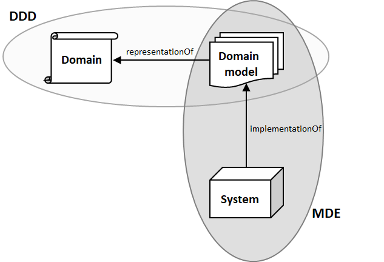

# Acknowledgements
## 定义
### DDD
Domain-Driven Design，领域驱动开发。是一种指导复杂软件开发的方法论。

许多项目做了建模的工作，但是最后却没有获取到实际的益处。DDD提炼出了一些有效的、从细节到全局的实践经验。

DDD主要有以下特点：
1. 聚焦于core domain
2. 通过领域专家与软件开发者协同进行model的探索
3. 在指定的bounded context中使用ubiquitous language

### domain
知识、影响、活动相关的领域。
### model
domain某一方面的抽象，用于描述及解决domain此方面的相关问题。That distillation of knowledge into a clear set of concepts is a modeling process.
### context & bounded context
context是指决定术语（包括model等）、陈述含义的一个范围。bounded context是指这个context是有界限/边界的，并通常以此边界来划分子系统、Team。
### ubiquitous language
在一个bounded context中，被一个团队所统一使用的术语。包括开发人员之间的统一，也包括开发人员与领域专家之间的统一。
model的抽象也是在开发人员和领域专家共同讨论下完成的，在这一过程中形成了统一语言
统一语言的变化往往伴随着model的调整。
### Continuous Integration
当多名成员在一个界限上下文中工作时，model都会有着碎片化的趋势，因此采用持续集成减少每次变化的量以及时发现问题。
### DDD vs MDX
MDD（Model-Driven Design）、MDA（Model-Driven Architecture）、MDE（Model-Driven Engineering）

#### DDD vs MDE
DDD provides an extensive set of design practices and techniques aimed at helping software developers and
domain experts to share and represent with models their knowledge of the domain.

DDD与MDE一样，均很看重Model

MDE can be regarded as a framework that provides the techniques to put DDD in practice

https://modeling-languages.com/comparing-domain-driven-design-model-driven-engineering/

#### DDD vs MDD

https://www.dddcommunity.org/uncategorized/evans_2004/

## DDD落地相关技术
1. CQRS
2. Event Sourcing
3. Qi4j
4. Naked Objects -> 书籍：DDD with Naked Objects
5. Roo

## 相关书籍
The big Blue Book: 《Domain-Driven Design, Tackling Complexity in the Heart of Software》
The big Red Book: 《Implementing Domain Driven Design》
《DDD with Naked Objects》