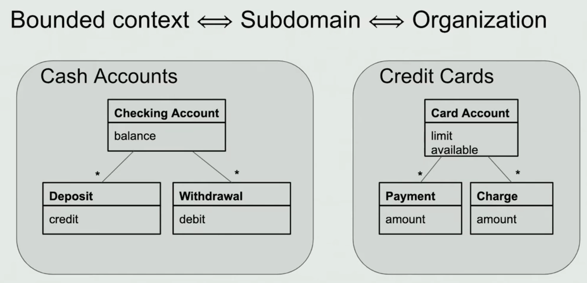

# Acknowledgements
## DDD介绍
Domain-Driven Design，领域驱动开发。是一种指导复杂软件开发的方法论。

许多项目做了建模的工作，但是最后却没有获取到实际的益处。DDD提炼出了一些有效的、从细节到全局的实践经验。

DDD并非独立的、全新的理论，而是吸收了软件开发过程中诞生的诸多不错的思想，最终的目的即是帮助更好地建模。

DDD主要有以下特点：
1. 聚焦于core domain
2. 通过领域专家与软件开发者协同进行model的探索
3. 在指定的bounded context中使用ubiquitous language

总结：
1. DDD只是理论
2. 理论尚未统一，仍有许多不同观点

## domain
"领域"，主要与业务知识Knowledge、影响Influence、活动Activity相关。
do-main：主要做的事情
```
支付域 --> 主要做支付相关的事情
配送域 --> 主要做配送相关的事情
```

domain又可分为多个子域subdomains，包括core domains, supporting domains 和 generic domains。
1. core domains：系统最关心，最核心的部分
2. supporting domains：支撑core domains的部分
3. generic domains：需要，但不用太关注的部分，通常可以直接购买

对营销系统，营销活动就是core domain，商家、账户、卡就是supporting domains，短信提醒就是generic domains。

## model
domain某一方面的抽象，用于描述及解决domain此方面的相关问题。将业务知识提炼成一系统清晰的概念即是建模。
## context & bounded context
context是指决定术语（包括model等）、陈述含义的一个范围。the setting in which a word or statement appear that determines it's meaning.
> 语文题：请参照上下文，解释文中划线的部分。

bounded context是指这个context是有界限/边界的，并通常以此边界来划分子系统、Team。
一个系统难免有多个model，为了避免因model较多而产生混乱，采用bounded context对多个model进行收纳限定。
bounded context也是一系列相似问题的描述及处理的界限，相对于界限外部处于黑盒状态。
体现了一个隔离性，这也是为什么ubiquitous language也是限定在了bounded context内。
> Bounded Contexts + Events => Microservices
## ubiquitous language
在一个bounded context中，被一个团队所统一使用的术语。包括开发人员之间的统一，也包括开发人员与领域专家之间的统一。
model的抽象也是在开发人员和领域专家共同讨论下完成的，在这一过程中形成了统一语言，因此统一语言的变化往往伴随着model的调整。
> 在系统全局层面统一语言不太可行且太耗费成本


## 防腐层ACL（AntiCorruptionLayer）
不同界限上下文可能并未做到统一语言，其模型也可能不尽相同（同一model可能存在不同的bounded context）。因此需要一个独立的部分来做其对应，防止对统一语言（也代表着model）产生影响。
历史系统与新系统之间可用防腐层
> 供应链-库存侧&配送侧对"可用量"的定义不同。
> 会员营销这边对poiId以及tenantId的定义和外部不同

1. 拥抱ACL，即使ACL比新系统更复杂
2. ACL可单独成为一个微服务、也可建立在新系统中

### Subdomain VS BoundedContext
the subdomains live in the problem space, and the bounded contexts in the solution space, bounded context is guided by a sub-domain。


### 界限上下文如何确定
1. 团队/组织
> 康威定律：设计系统的架构受制于产生这些设计的组织的沟通结构。
2. 物理层面的隔离，比如代码库、数据库、部署
3. Service boundary，服务层面的界限
> 利用Event Storming来对服务界限进行识别&认知统一


### Continuous Integration
当多名成员在一个界限上下文中工作时，model都会有着碎片化的趋势，因此采用持续集成减少每次变化的量以及时发现问题。

## Layered Architecture分层架构
通过分层架构维持domain的简洁，摆脱UI及database相关的代码。
一般可分为：~~userCase/Controller~~, application, domain, infrastructure, acl, repositories, factories

### infrastructure与DIP


### domain与ApplicationService
#### 逻辑代码放在哪？domain还是单独的业务逻辑层ApplicationService？
1. domain放 "entity knowledge"实体知识，主要为一些不管产品需求如何变化都不会影响到的逻辑
2. ApplicationService放 "business logic"业务逻辑，主要为一些会根据需求变化的逻辑
3. 不能在domain中调用另一个domain的逻辑，这个调用应交由ApplicationService来编排
#### ApplicationService出现重复代码？
一些ApplicationService中相对固定的编排容易出现代码重复，比如：新用户领取卡同时也自动成为会员-ApplicationService同时编排Card、User两个AggregateRoot/Entity。
将公共逻辑下沉到位于domain层的DomainService。
```
-domain
--service
--subdomain0
--subdomain1
--subdomain2
```
### 相关软件架构
1. Hexagonal Architecture
2. Onion Architecture
3. Screaming Architecture
4. DCI
5. BCE
6. Clean Architecture

CQRS与Event Sourcing是DDD中比较主流的架构选择。
Qi4j、Naked Objects、Roo虽然并未那么普及，但也有比较重要的意义。

## Entity与Value Object
都是具有一些属性的对象，但Entity一般具有id，并通过id进行标识而不是其属性，具有生命周期，在生命周期内存在着属性的变化。【个人观点：sql中的table通常有一个对应的Entity】
Value Object没有id，主要用于描述、计算。为不可变对象，通常没有属性的变化（如果有属性的变化，则重新创建一个对象）。

最经典的Value Object之一：

物品的价格：
```java
// Entity
public class Product {
    private long id;
    private String name;
    private Price price;
    
    public void changePrice(int addCount) {
        this.setPrice(this.price.add(addCount));
    }
}

// ValueObject
public class Price {
    private int amount;
    private String currency;
    
    public Price add(int addCount) {
        return new Price(this.amount + addCount, this.currency);
    }
}
```

1. Entity有id，Value Object没有
2. Entity通过id判断相等，Value Object通过属性判断
3. Entity有生命周期，Value Object没有
4. Value Object为不可变对象
5. Value Object依赖于Entity存在；如果觉得Value Object重要程度提升了，可以升级为Entity，有无id也是重要程度的一个体现（个人观点）
6. 我们只关心 Value Objects 是什么，而不关心他们是谁（个人观点）

## Aggregate & AggregateRoot
當我們的領域擁有越來越多的 Entity 與 Value Object，根據業務規則的需求，模型之間關聯性的複雜度可能會超出我們的想像。
尤其是當你越想要在生命週期中維護完整性，你就越難管理他們的關聯。

比如一張訂單由訂單品項、折扣、金流、物流、發票等要素組成，但一旦你修改了一個訂單品項，
你必須連帶地重新計算折扣(滿額折扣)、金流(刷退重新付款)、物流(金額限制)、發票(廢除後重新開立)，甚至可能還會影響會員等級的升降。


OrderItem.update() → Order.check() → Order.update() → Inventory.update()，如果使用 Aggregate，那就會變成 Order.updateItem() → Inventory.update()


Aggregate是多个非常相近功能的Entity的组合，一个Aggregate挑选一个最核心的Entity做为AggregateRoot。
Aggregate外部只能与AggregateRoot直接沟通。

### Aggregate设计原则
1. Aggregate Root 負責檢查邊界內所有固定規則
2. Aggregate 外的物件不能引用除了 Aggregate Root 之外的任合內部物件
3. 根據上一條規則，只有 Aggregate Root 才能直接透過資料庫查詢來獲取。內部的其他物件都要透過 Aggregate Root 才能取得。
4. Aggregate 內部物件可以引用其他 Aggregate Root，但僅能引用該 Aggregate Root 的 ID
5. 刪除Aggregate Root操作必須一次刪除 Aggregate 邊界內的所有物件
6. Aggregate内使用事务保证一致性，在邊界之外使用最終一致性
7. Aggregate 拆越大，複雜度越低、效能越差；Aggregate 拆越小，複雜度越高、效能越好。

如果說 Bounded Context 像是國界，阻擋外部勢力的不當入侵。
那麼 Aggregate 就像是國界內的一個個小幫派，而幫派之間只能透過老大(Aggregate Root) 來溝通，幫派之內也只有老大 (Aggregate Root)可以指派小弟 (Aggregate 內其他物件) 做事情。

## Aggregate & Repository
一个Aggregate对应一个Repository，并通过这个Repository进行持久化/加载。
1. Aggregate与Repository一一对应
2. Repository一次拿出一整个Aggregate
3. Repository一次保存一整个Aggregate

## 遇到实例
商家反馈域：申诉、复检、整改
方式一：反馈单Entity/AggregateRoot、申诉单Entity、复检单Entity、整改单Entity
方式二：反馈单Entity、申诉信息ValueObject、复检信息ValueObject、整改信息ValueObject

## 相关书籍
The big Blue Book: 《Domain-Driven Design, Tackling Complexity in the Heart of Software》 - 2004
The big Blue Book: 《Domain-Driven Design Reference》 - 2015
The big Red Book: 《Implementing Domain Driven Design》 - 2013


《DDD with Naked Objects》
https://www.infoq.com/presentations/microservices-ddd-bounded-contexts/
https://martinfowler.com/bliki/BoundedContext.html
[Bounded Contexts - Eric Evans - DDD Europe 2020](https://www.bilibili.com/video/BV1SK4y1j7rZ/)
Clean Architecture: A Craftsman's Guide to Software Structure and Design, First Edition
[干净架构最佳实践](https://blog.jaggerwang.net/clean-architecture-in-practice/)
[Android 架构：Part 2 —— 介绍 Clean Architecture](https://juejin.cn/post/6844903888739368967)
[Entity vs Value Object: the ultimate list of differences](https://enterprisecraftsmanship.com/posts/entity-vs-value-object-the-ultimate-list-of-differences/)