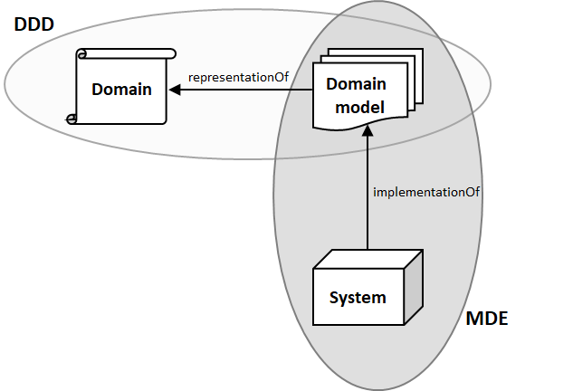

# 草稿
https://reflectoring.io/spring-hexagonal/

思考问题时，"what"的优先级要高于"how"，不要一味地思考"how"而忽略了更重要的"what"
The conceptual "what" is swamped by mechanistic "how".

The whole set of domain driven pattern and methodologies should be used only with complex business domains.

Moreover, a junior modeler could simply miss the point of the business itself and design a model more complex than the
business (often in a quest for flexibility).

To me, a Segregated Core refers to organising domain components into completely separate packages, but together represent
the same core domain. A large core may benefit from this type of organisation to clarity the composition of the domain, 
or to separate supporting capabilities from core domain concepts.

A Segregated Core specifically is useful when the number of Domain objects(Entities, Value Objects, etc) becomes so large
that it makes sense, for cohesion and architectural simplicity, to split things apart.

### 大泥球
系统总体架构未良好定义，随意结构化

碎片化的不受管制的临时、权宜修补，而不是最佳调整
需求的不断变化
人员变动

SOLID, GRASP, KISS

面条式代码/意大利面条式代码：

程序的流向就像一盘面一样扭曲纠结

### DDD vs MDX
MDD（Model-Driven Design）、MDA（Model-Driven Architecture）、MDE（Model-Driven Engineering）

#### DDD vs MDE
DDD provides an extensive set of design practices and techniques aimed at helping software developers and
domain experts to share and represent with models their knowledge of the domain.

DDD与MDE一样，均很看重Model

MDE can be regarded as a framework that provides the techniques to put DDD in practice

https://modeling-languages.com/comparing-domain-driven-design-model-driven-engineering/

#### DDD vs MDD

https://www.dddcommunity.org/uncategorized/evans_2004/

备忘
- Qi4j
- DDD with Naked Objects
- Roo

